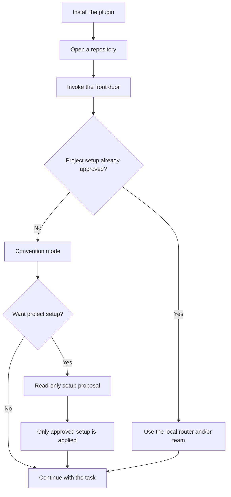

# Plumbline

Plumbline is a workflow plugin for Codex and Claude Code. It helps an agent turn a software goal into a change that is planned when needed, checked before it is called done, and easier to understand later.

Tell it the outcome you want, what must stay true, and where any existing plan or design lives. Plumbline keeps a small, clear request small; larger or uncertain work can move through shaping, specification, planning, implementation, review, and closeout.

You stay in charge of product intent and decisions that are hard to undo. Plumbline supplies structure around the work.

## When Plumbline helps

Use it when:

- a request crosses several parts of a repository and needs order or ownership;
- a bug or regression needs a diagnosis and evidence, not just a quick guess;
- the intended behavior is still unclear;
- you already have a plan, specification, handoff, or work order and want the agent to pick it up;
- longer work needs a small, current record of decisions, proof, and next steps.

For a one-line rename or an obvious edit, direct work is usually enough. Plumbline does not force every task through every step.

## Install once

Install Plumbline in your coding tool. Installation makes its workflows available; it does not initialize a repository, create project files, or turn on automatic routing.

### Codex

From the Codex CLI:

```bash
codex plugin marketplace add nickyfactz/plumbline@main
codex plugin add plumbline@plumbline
```

Start a new Codex session after installation. In Codex desktop, open the repository as a project, choose the Codex surface, then install **Plumbline** from **Plugins**.

### Claude Code

From Claude Code:

```bash
claude plugin marketplace add nickyfactz/plumbline@main
claude plugin install plumbline@plumbline
```

Reload the plugins or start a new session. In Claude desktop, open the repository in the **Code** tab, then use **Plugins → Add plugin** to install **Plumbline**.

For local-checkout commands, exact desktop paths, and provider-specific details, see [How to use Plumbline](docs/how-to-use.md).

## Your first request

Open the repository you want to work on, then use the main command for your tool:

- Codex: `$plumbline`
- Claude Code: `/plumbline:plumbline`

Tell it:

- what you want to be true when the work is finished;
- what must not change;
- where useful existing notes or files live.

For example:

```text
$plumbline Add import/export for the project configuration. Keep the existing format compatible. The design notes are in docs/configuration.md.
```

You do not need to choose a workflow step first. If you already know which step you want, the public side doors are listed in the [how-to-use guide](docs/how-to-use.md).

## What happens after installation



An uninitialized repository is a valid starting point, not an error. Plumbline reads the repository guidance and existing artifacts that matter, then works in convention mode. A sufficient plan or specification from another tool can be used without initialization.

## Initialized and uninitialized repositories

| Project state | What Plumbline does |
| --- | --- |
| Uninitialized | Starts when you explicitly invoke it, uses existing repository conventions and artifacts, and does not create a router or team. |
| Router initialized | Ordinary repository prompts can reach the front door through a small project-local router. |
| Agent team initialized | Approved project-local roles are available when the work benefits from help. |
| Both initialized | Ordinary prompts can be routed, and suitable work can use the approved local roles. |

A router or team is an available capability, not a demand that every task use every step.

Initialization is always explicit. Run `$plumbline-init` in Codex or `/plumbline:plumbline-init` in Claude Code, or ask the front door to initialize the repository. Plumbline first presents a read-only proposal describing each file and setting it would change. You choose the router, the team, both, or neither; nothing is written until you approve the proposal.

## What Plumbline gives you—and what it does not

- Right-sized process: a small task can stay direct, while uncertain or material work gets the planning and checking it needs.
- Reuse instead of repetition: existing plans, specifications, and handoffs can guide the work regardless of which tool created them.
- A clearer trail: longer work can keep current decisions, evidence, remaining risks, and the next action in one place.
- Bounded collaboration: optional project-local roles can research, design, implement, review, or check acceptance within explicit limits.
- No silent setup: Plumbline does not install global agents or settings, create an external tracker, invent a custom worktree system, or silently create branches.
- You own the product choices. The main conversation owns plans, integration, Git, and one-owner operations such as builds, deployments, restarts, migrations, and publishing.
- Team roles stay bounded. Researchers, architects, code-reviewers, and QA auditors are report-only and receive no write set; an implementer changes only its approved files; workers do not spawn children. Read-only and plan permissions express intent, not hard isolation when the parent task is writable.
- The optional continuity hook is inert until you enable it and explicitly invoke Plumbline. It can restore a short reminder after a resumed or compacted session, but it never chooses a phase, runs setup, edits the repository, or dispatches agents.

## Learn more

[How to use Plumbline](docs/how-to-use.md) covers exact installation paths, side-door commands, initialization choices, project-local teams, Codex and Claude differences, optional continuity, and advanced recovery behavior.

For the implementation map and validation guidance, see [architecture](docs/architecture.md) and [evaluation](docs/evaluation.md).
